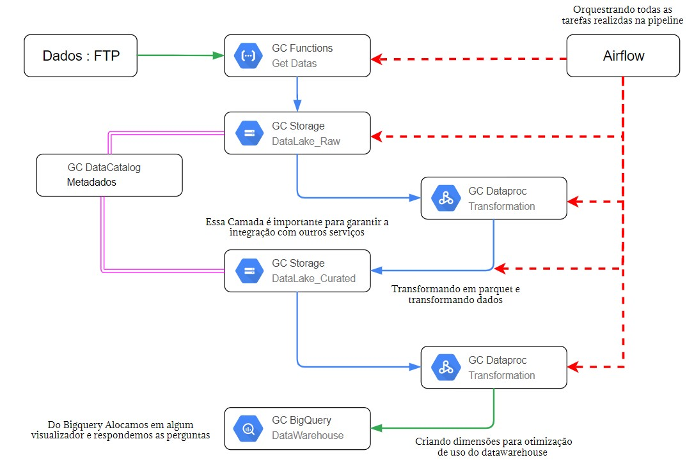

# **Hackathon A3Data**: Equipe Ipatinga

Neste repostório vamos alocar todo nosso trabalho feito no hackathon preparado pela empresa A3Data. O termo hackathon vem da junção das palavras em inglês  "to hack" que é quebrar e "marathon" que é maratona. Basicamente uma maratona de programação e essa em especial focada em engenharia de dados. 

Como base todo "hackton", termo abrasileirado, deve ser um evento na qual apresente um desafio a ser resolvido com a presença de profissinais com experiencia e/ou conhecimento na área do problema.

---

# > **O DESEAFIO**

A equipe de desenvolvimento da A3Data propuseram que fossem implementada uma pipeline onde fossem conteplada a extração, transformação e disponibilização dos dados. Onde nesta pipeline também fossem realizado toda estruturação e ao final fossem respondida as um conjunto de perguntas.

A fonte de dados são os micro dados da Rais(ministério do Trabalho). Como objetivo coletar apenas os dados do periodo de 2010 a 2019.
--

# > **Perguntas Chave**

Para responder estas perguntas será necessário a criação de um ambiente visual. As pergunta a serem respondidas são:

1. Nos últimos 10 anos, quais foram os salários médios de homens e mulheres que trabalham com tecnologia na região sudeste do Brasil por ano?

2. Nos últimos 10 anos, quais foram os salários médios das pessoas por nível de escolaridade que trabalhavam no setor de agronegócio na região sul do Brasil?

3. Entre os setores de tecnologia, indústria automobilística e profissionais da saúde, qual deles teve o maior crescimento? Qual foi o número de trabalhadores em cada setor por ano?

4. Nos últimos 10 anos, quais foram os setores que possuem, em cada ano, o maior número de trabalhadores que possuem jornada semanal inferior a 40h?

5. Qual é o número absoluto de pessoas por cada categoria de sexo que realizaram trabalho intermitente em cada um dos últimos anos?

---

# > **Avaliação**

Como avaliação teremos que conteplar 5 critérios nesta pipeline que serão os principais pontos de avaliação:

- Escalabilidade
- Confiabilidade
- Facilidade de integração em Produção
- Eficiência Operacional
- Otimização de Custos

---

# **START -> HANDS-ON**

Com base na introdução do hackathon e pensando nos critérios a serem avaliados estrturamos a seguinte sequência de trabalho na construção da pipeline:

1. Buscar a fonte de dados e entender a dimenção dos dados.

2. Estruturar e escolhe formato de produção.

3. Construir um Ci/CD

4. Construir Arquitetura proposta

5. Criar visualização gráfica como respostas das perguntas chave.

## Tópico 1: DADOS

Fomos em busca dos dados a fim de encontrar como estes são alocados. Com uma pesquisa conseguimos achar a fonte dados que estão alocados na [página do governo](http://pdet.mte.gov.br/microdados-rais-e-caged). 

O acesso dos dados segue formato FTP e para acessa-los basta utilizar o link: `ftp://ftp.mtps.gov.br/pdet/microdados/`

Quando acessamos podemos observar que os dados eram divididos por estado e quando compactados chegavam ao lindos valores de 23gb.

Quando nos deparamos com isso vemos de cara que será necessário trabalhar em cluster com esses dados. Pensando nisso partimos para o tópico 2.

## Tópico 2: Arquitetura

Como não temos acesso direto a cluster e servidores on premises vamos ter fazer o uso de alguma plataforma cloud. Todos da equipe tem conforto em utilizar AWS(Amazon Web Service), mas quando pensamos em algumas arquiteturas nos batemos em custo talvez um pouco elevado. Pensando nisso, e até mesmo como nos desafiar tomamos a liberdade de escolher a google cloud como nossa plataforma.

Primeiro ponto, montamos a ideia de infra estrtura nos baseando em uma arquitetura lambda e nas ferramentas que conhecemos da AWS. Feito isso começamos a enteder quais ferramentas da google cloud nos atenderia de forma igual ou similar. Dessa maneira chegamos a seguite arquitetura:

## Topico 3: Continouos Monitoring

Como ferramenta de versionamento vamos utilizar o Github e para realizarmos nosso continuos integration vamos utilizar o gitaction para aplicar todas etapas de testes e deploy. Para isso vão ser criadas as seguintes etapas:

- Testando google function
- Validando infraestrutura
- Iniciando packages
- Testes
- Deploy

Como continouos delivery vamos trabalhar tomando noção de três ambientes o `production` que vão estar todos os sistemas que estão atuando ativamente no processo. Como também a `Develop` onde iremos criar todas as aplicações. Ja o `staging` vão ficar as aplicações foram validadas mas ainda precisam esperar para entrarem em produção.

Como orquestração da pipeline vamos optar pela utilização da ferramenta apache Airflow que como mais conhecida função trata-se de agendamento de tarefas.

## Topico 4: Construindo Arquitetura

Como escolha vamos usar a linguagem `Python` e como ferramenta de desenvolvimento vamos utilizar o terraform.

## Topico 5: Visuzalização

Ainda não decidimos mas provavelmente ou será o data stúdio ou o power BI.